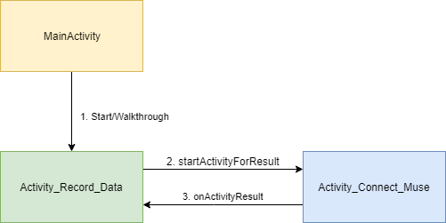

# EEG Data Collection  
An Android application that aims to collect stress and mindfulness state as training data to generate a SVM Model for Active/Mindfulness State prediction.  

Stressor
- The Montreal Imaging Stress Task.  

Mindfulness
- Guided Meditation from The Honest Guys (https://www.youtube.com/watch?v=6p_yaNFSYao&t=519s)

The application is best viewed on Samsung Tab S2 9.7 inch.

[Installation Guide](#installation-guide)  
[User Guide](#user-guide)

# Installation Guide

## Software Installed and Tested On
- Android Studio 3.1.2
- Windows 10 Version 1803

## Hardware used
- Samsung Tab S2 9.7 inch


## Gradle dependencies
```
implementation 'com.android.support:support-v4:26.1.0'
implementation files('libs/libmuse_android.jar')
implementation files('libs/bsh-core-2.0b4.jar')
implementation 'com.android.support.constraint:constraint-layout:1.0.2'
```

## Setup Guide

Install Android studio from https://developer.android.com/studio/

1. Clone Repository using Android Studio

2. Open the project

3. Import Project from Gradle with default settings.

4. Let android studio load the project. It will prompt you to install 'android-26'. If not installed click on 'install missing platform and sync project'.   

5. Click on next to install Android SDK Platform 26


6. Once completed, you are now able to build and run app. Press Shift + F10 to run the application. You may get a prompt asking you to update Gradle Plugin and install instant run. You can choose to install or not, both will work.


# User Guide
Do read up on the Montreal Imaging Stress Task for a better understanding of how the stress test is conducted. 

## Components of data collection
1. Arithmetic Training
Arithmetic Training will require the participants to solve a series of arithmetic questions which can be answered with a single key stroke. All answers will be a single digit number.   
Arithmetic Training is used to determine the participant capability in solving the arithmetic questions.   
The average time used to solve the question will be used to set the timeout of the questions during the arithmetic test.

2. Guided Meditation  
During the guided meditation, the participant will have to listen to a guided meditation sound track and perform the task as described by the track.     
The EEG data captured during this component will be labelled as Mindfulness state.   

3. Arithmetic Test  
Arithmetic Test is similar to Arithmetic training with the exception that it has a timer underneath the question.  
The timeout will be set to the average time taken to answer each question during the Arithmetic Training.  
The percentage of correct answers will be displayed at the top right hand corner once the participant has answered a question.   

## Diagrams 




## Data Collection Guide

### Hardware required  
- Muse (For EEG Data Collection)
- Earpiece (For Guided Meditation)


### Walk-though
Walk-through the application with the user using the walk-through button. The training time modifier used to set the time during the arithmetic training.  
Allow the participants to trial on the questions before the data collection.


### Explanation for each display

1. Landing page. Ensure that the participant is wearing the Muse headband and the headband is turned on. Tap start when ready.

2. Muse Selector. Select the Muse device the participant is wearing.

3. Wait for the Muse to connect to the device. May take several retries.

4. Adjust the headband until all 4 channels are showing "Excellent". The "Begin Arithmetic Training" button will be unlocked when the Muse Channels are all "Excellent" for 3 seconds.  

5. The Arithmetic Training will require the participants to answer arithmetic questions. The numbers will be generated from 0-99 and answer will be from 0-9.

6. Once the timer expires, a instructional dialogue will appear. Follow the instructions as written on the dialogue. Take note of the ending phrase.

7. The guided meditation page. The progressbar above shows how long before the guided meditation will end. You may want to increase the timeout of the display otherwise the display may turn off before the guided meditation end. If the participant are not attentive they may not know if the guided meditation has ended.

8. Completing the guided meditation, another instruction dialogue will appear. Remind the participant that the average score is above 75% hence, they would need to get above 75% to be average. This creates additional stress for the participant. Remind the participant to take a short break. Some of them would be slightly sluggish after the meditation.

9. Arithmetic Test page. There is an additional timer under the question for the question timeout. The percentage of correct answers will be displayed once the user has answered a question on the top right hand corner.

10. The following 3 images shows the "correct", "wrong" and "timeout" scenario.


11. Once the timer ends, a dialogue will display to let the user know that the arithmetic test has ended.

